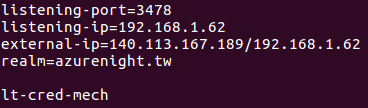
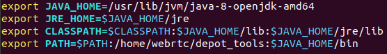
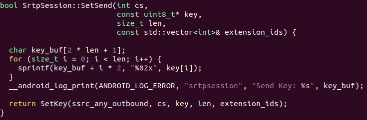
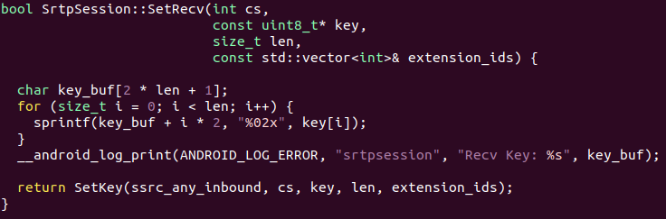

# 程式架構及環境設定
## Secure Phone App

### MainActivity.java
和Firebase溝通，  
取得會員資料並對使用者輸入的帳密進行驗證。

### CallActivity.java
讓使用者輸入room name，  
並選擇想使用的功能種類(視訊通話、文字及檔案傳輸)。

### VideoActivity.java
處理「視訊通話」的部分，  
**VideoSignalingClient.java**負責和VideoSignalingServer溝通。

### TextActivity.java
處理「文字及檔案傳輸」的部分，  
**TextWebRTCClient.java**負責實作大部分的功能，  
**MagicFileChooser.java**負責檔案傳輸中，有關檔案選取的部分。

## Secure Phone Server

### Firebase
透過Google帳號啟用Firebase的功能之後，  
使用Android Studio和其進行連結，  
並根據期末報告中的Firebase console的截圖，  
設定Firebase console中有關於real-time database的部分。

### VideoSignalingServer
「視訊通話」部分的Signaling Server，  
初次使用時，必須先執行`npm install`來安裝需要的套件，  
透過`node index.js`來啟動Server，  
會listen在1794這個port。

### TextSignalingServer
「文字及檔案傳輸」部分的Signaling Server，  
初次使用時，必須先執行`npm install`來安裝需要的套件，  
透過`node app.js`來啟動Server，  
會listen在3000這個port。

### Coturn
在Ubuntu的環境中，  
初次使用時，  
必須先透過`apt install coturn`來安裝Coturn，  
並使用`turnadmin`來新增TURN Server的使用者，  
並設定TURN Server的設定檔，  
預設的路徑位於「/etc/turnserver.conf」，  
詳情請參考附圖。  

  
註：設定使用者和修改設定檔時，  必須確認**realm**的部分是相同的。

# 編譯WebRTC source code
可參考[此連結](https://webrtc.org/native-code/android/)，  詳細步驟說明如下：
1. 安裝Depot Tools
2. 透過`fetch --nohooks webrtc_android`取得原始碼
3. 透過`git checkout`，切換到對應的版本  
註：雛型系統中，使用的WebRTC版本號是「1.0.23430」，  
其對應的commit hash為「cd51375e0cd92c2b6740d1cf1b6e576cee7a5639」。
4. 執行`gclient sync`
5. 透過`./build/install-build-deps-android.sh`安裝編譯時必要的套件
6. 修改**.bashrc**以設定Java的環境變數，詳情請參考附圖

7. 透過`./tools_webrtc/android/build_aar.py`編譯出aar格式的library  
註：編譯完成後，library會位於根目錄底下，名為「libwebrtc.aar」。  
  
目前source code的部分，  
只有修改過「pc/srtpsession.cc」這個檔案的**SetSend**和**SetRecv**，  
使其能夠在Android Studio的logcat中印出session key，  
詳情請參考附圖。  
  
註：需新增`#include <android/log.h>`於「srtpsession.cc」之中。

